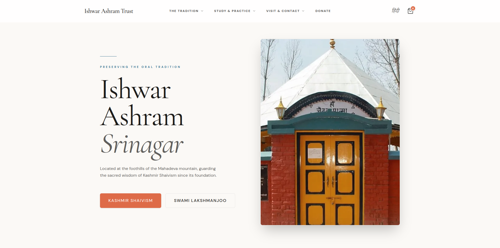

# Kashmir Shaiva Institute | Global Platform

> An Enterprise-grade, Multi-Tenant web architecture built to unify the global centers of the Kashmir Shaivism teachings.

**🌍 [View Live Platform](https://kashmirshaivainsitute.org)**

  

 

## 🎨 The Design Engineer Approach

This project bridges the gap between high-end digital design and robust software engineering. As a **Design Engineer**, the primary goal was to deliver a visually immersive, calm, and performant user experience while maintaining a deeply scalable, type-safe underlying architecture.

## ⚙️ Tech Stack & Tooling

- **Core:** React 19, Next.js 16 (App Router)
- **Styling:** Tailwind CSS, Radix UI Primitives, Lucide Icons
- **Motion:** Framer Motion
- **Validation:** Zod (Strict Type schemas)
- **Transactional Email:** Resend API
- **i18n:** `next-intl`
- **CMS:** Contentful (Headless)

---

### Key Design Engineering Highlights:

- **Kinetic Typography & Micro-interactions:** Built a custom declarative animation configuration using `framer-motion`, utilizing strict Cubic-Bezier easing curves (`[0.16, 1, 0.3, 1]`) to emulate natural, gravity-based motion.
- **Parallax & Scroll Awareness:** Implemented hardware-accelerated `useTransform` and `useScroll` hooks to create depth in the Hero sections without compromising the main thread.
- **Design System to Code:** Translated a fluid design system into Tailwind CSS variables, ensuring 100% consistency across light/dark themes and multi-tenant branding.
- **Zero-Layout-Shift Loading:** Engineered strict Image layout properties and font-loading strategies to achieve optimal Core Web Vitals (LCP & CLS).

---

## 🏗️ Technical Architecture

Beyond the UI layer, this application acts as a distributed system handling multiple domains, languages, and transactional states.

### 1. Edge-Level Multi-Tenancy & i18n

Utilized Next.js 16 `proxy` (formerly middleware) to intercept requests at the Edge. The platform dynamically resolves the Tenant (Srinagar, Delhi, or KSI) and Locale (`en`, `hi`) based on the incoming Host header, rendering localized content natively without client-side redirects.

### 2. Server-Side Dictionary Injection (Zero Bundle Cost)

To support deep localization (English and Hindi) without bloating the React Client Bundle, all `next-intl` translations are fetched asynchronously on the Server Components and passed down to "Dumb" Client Components via strict TypeScript interfaces.

### 3. Request-Scoped Server Actions

Forms (Checkout, Contact, Donations) are handled via Next.js Server Actions. To ensure strict i18n compliance in a Node.js single-threaded environment, `zod` validation schemas are instantiated _inside_ the Server Action (`Request-Scoped`), allowing real-time translation of validation errors without memory leaks.

### 4. Programmatic CMS Seeding (Contentful)

Engineered an automated Node.js ETL script using the `contentful-management` API to scrape, merge, and inject complex product data (Books, E-Books) and Assets into the Headless CMS, mapping visual data to strict content models.

---

### 🔒 Repository Note (Sanitized Mirror)

_This repository is a sanitized, public mirror of the original private codebase. The commit history has been replayed and squashed to demonstrate the architectural evolution of the project while omitting sensitive configuration data, API keys, and internal CI/CD experiments to comply with security best practices._
